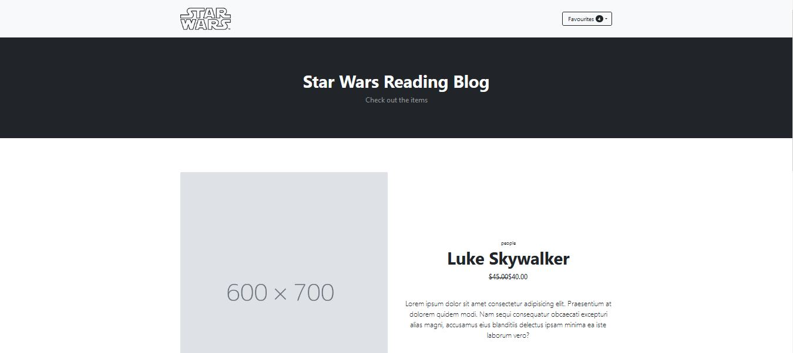

# Contact List with React using UseContext and Api's

This is a simple CRUD application which allows the user to perform all CRUD operations with a remote API. It uses React UseContext with a store to centrally manage data and actions rather than overusing props passed between components. It also has validation and push notifications on API response and validation tests.

Preview:

